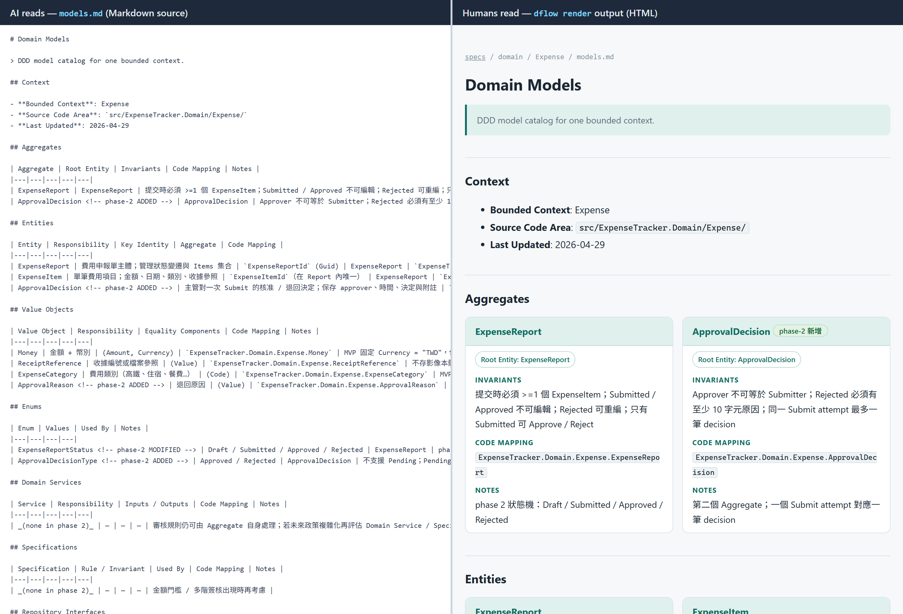

# Dflow

[繁體中文](README.md) | **English**

> **AI collaboration without DDD = accelerated chaos; with DDD = AI constrained inside the domain model upfront.**
> A Rich Domain Model (business rules encoded into domain objects themselves, not scattered across services or prompts) puts invariants, business rules, and Aggregate boundaries inside the objects — every line of code the AI writes must pass through that contract. Dflow treats DDD as the semantic backbone of SDD.
>
> **Dflow doesn't teach AI what DDD is — it's a scaffold:** it forces the AI to keep a full record of the trade-offs behind each design decision and fills in the blind spots the AI tends to miss while filling in details on its own and that review can't easily catch.
>
> In other words: not whether the AI can do DDD, but whether you can trust it when it does.

Concretely, it is a spec-first workflow kit for AI-assisted software development: change requests become structured specs, domain language, and implementation plans first, and code only after alignment — instead of the round-trip where AI jumps from an ambiguous prompt straight to code and has to be redirected after the wrong direction lands. The goal is not the process itself, but repeatable software change with clearer meaning, fewer scattered rules, and less prompt-dependent behavior.

## Key Features

| Feature | What it gives engineering teams |
|---|---|
| **Greenfield and Brownfield tracks** | New projects get room to shape architecture and the domain model early; existing codebases skip the big-bang refactor and extract scattered domain rules progressively while changing behavior. |
| **Hybrid workflow control** | Commands for explicit entry, AI nudges when you forget to start a flow, pauses at key decisions to confirm direction. Together they keep the AI on track without turning every step into overhead. |
| **DDD semantic backbone** | Write the domain language, boundaries, and rules down first, so AI fills in details under project constraints instead of inventing plausible-but-wrong business rules — the kind review rarely catches by eye. |
| **Anti-overdesign built into the guidance** | Once guided into DDD, AI tends to apply rich models and heavyweight patterns everywhere; Dflow writes reverse criteria at the common overshoot points — where deeper modeling isn't worth it, when to stop at the simplest rung. |
| **Three-layer documentation model** | phase (one propose-implement cycle) / feature (the whole branch's running state) / system (cross-feature long-term knowledge), matching how feature branches actually evolve. Detailed below. |
| **Change-depth-based tiers (T1/T2/T3)** | AI scales specification and verification by change depth: a color/typo tweak hosted under a feature takes one inline `_index.md` row, functional bug fixes take a lightweight spec (a T3 display-copy defect is still one inline row), and new features or bounded-context-level changes go through a full phase-spec. Small changes aren't dragged down by process. |
| **Drift verification** | `/dflow:verify` cross-checks specs, domain documents, implementation, tests, and debt records to surface the "documentation still describes the old behavior" drift that PR review by eye usually misses. |
| **Specs humans can read, not just AI (md → HTML)** | `dflow render` mirrors the AI-facing dense Markdown specs into browsable static HTML (tables become cards, markers become badges; side-by-side screenshot below). Markdown stays the AI-facing source of truth. |
| **Multi-AI-tool rule sharing** | A canonical project guide plus thin per-tool shims (`CLAUDE.md` / `AGENTS.md` / Copilot instructions) — no duplicate rule copies when switching between Claude, Codex, and Copilot; all three share one agentskills.io project-level skill with natural-language auto-trigger (Copilot CLI summons it via `/dflow`). |

## Get Started

Prerequisites: Node.js / npm installed, with the global npm bin directory on
your `PATH`.

Install Dflow globally, then run it from the root of the project you want to
adopt it in:

```bash
npm install -g dflow-sdd-ddd
dflow init
```

The init flow asks whether the project is greenfield or brownfield, which Git
policy the team follows (GitFlow / Trunk), how AI-made commits should be
marked, and which AI tools to configure, then previews the files it will create. Existing files are not overwritten. Init
creates workflow documentation and AI instruction files; it does not inspect,
refactor, or migrate your application code.

When AI tools were selected, init also installs the project-level skill for
them (Claude, Codex, and GitHub Copilot) **by default** — the source of
natural-language auto-trigger (you say "I want to add a feature" and the AI
suggests the matching workflow; Copilot CLI summons it via `/dflow`). On an
interactive terminal it asks one `(Y/n)` question — press Enter to install;
scripted (non-interactive) runs install by default, so existing automation
runs unchanged. Skill files are Dflow-generated derivatives: the recommended
default is to gitignore them and re-project after cloning (see the
version-control table below).

If the project is already initialized and you later add another AI coding
tool, run:

```bash
dflow configure-agents
```

It asks the same default-yes skill question for newly selected tools that have
no skill yet, so tools added later don't miss auto-trigger either. To
force-regenerate the skills for all selected tools (for example to refresh
them after upgrading Dflow), use `--skills`:

```bash
dflow configure-agents --skills
```

Answering `n` does not leave the AI trigger-blind — the project instructions
init writes already tell it to suggest the matching workflow — but reliability
differs: the skill hands triggering to the tool's native matching mechanism,
which is steadier than the model remembering instructions mid-session. You can
add it any time later with `dflow configure-agents --skills`.

If you also want tool-native `/` command / prompt menus, add `--command-adapters`
(it composes with `--skills`):

```bash
dflow configure-agents --command-adapters --skills
```

These commands (re)configure AI instruction files and refresh the
project-vendored workflow bundle, plus optional command adapters / skills; they
do not rerun init's interactive prompts and do not overwrite specs you authored
yourself.

### Start using the Dflow workflow

After init, start work through the Dflow workflow in your AI coding agent:

```text
/dflow:new-feature
/dflow:modify-existing
/dflow:bug-fix
/dflow:new-phase
/dflow:finish-feature
/dflow:verify
/dflow:pr-review
```

`/dflow:*` is Dflow's canonical shared vocabulary; each AI tool's `/` parser
behaves differently. Use these practical invocation forms:

| Tool | Recommended invocation |
|---|---|
| Claude Code after `--command-adapters` | `/dflow:<id>`, for example `/dflow:new-feature` |
| GitHub Copilot (VS Code Chat) | Command entry is `/dflow-<id>` (hyphen, needs `--command-adapters`); natural language also auto-triggers. `/dflow:<id>` (colon) is only a text reference, not a command |
| GitHub Copilot CLI | No per-id command; type `/dflow` to summon the skill, then describe the workflow in natural language |
| Codex CLI | no-slash plain text `dflow:<id>`, for example `dflow:new-feature` |

If your tool does not support custom slash commands, use the workflow name as
a plain instruction in chat. Dflow is Markdown-based workflow material plus a
scaffolding CLI, so it can be used with AI coding agents that can read project
instructions and repository context.

For the first adoption pass, use a branch or disposable sample project so your
team can inspect the generated `dflow/specs/` workspace before bringing the
workflow into an active codebase.

For a guided evaluation walk-through — what `init` creates, AI tool support,
track choice, and a 30-minute sample-project playbook — see [Evaluating
Dflow](docs/evaluating-dflow.en.md). For end-to-end scenario walk-throughs of
Greenfield and Brownfield workflows with worked spec outputs, see the
[`tutorial/`](tutorial/README.md) index.

### Render the specs as human-readable HTML

Dflow specs are AI-facing Markdown (dense tables, heavy markers). For human
reading, run:

```bash
dflow render
```

It mirrors `dflow/specs/` into a static HTML tree (default output
`dflow-specs-html/`; adjust with `--src` / `--out` / `--title`): record-style
tables become one card per row, AI-facing comment markers become badges,
gherkin blocks get keyword highlighting, and in-tree links are rewritten to
the matching HTML pages; open the output directory's `index.html` in a browser
(`file://` works; no server needed). Wall-length narrative crammed into a
single cell renders more readably: the card spans the full row and extra-long
fields collapse behind a pure-CSS "expand" toggle (printing always fully
expands). The `features/completed/` archive never flattens into the root index
— the root carries year links only, one standalone page per year, so a growing
archive never bloats the front page.

The same spec, read two ways — left: the AI-facing Markdown source (dense
tables plus AI-only markers like `<!-- phase-2 ADDED -->`); right: the HTML
`dflow render` produces (one card per row, markers become badges):



The example comes from this repo's Expense tutorial specs
([`tutorial/01-greenfield/outputs`](tutorial/01-greenfield/outputs/)); after
cloning and running `npm install`, reproduce it with
`node bin/dflow.js render --src tutorial/01-greenfield/outputs/dflow/specs`.

The division of labor: **Markdown is the AI-facing source of truth; HTML is
the human-reading projection.** Re-run `dflow render` whenever the specs
change (every run is a full rebuild). The output directory is managed by
render and **files render did not generate are never touched** — it is a
regenerable derived artifact, so add it to `.gitignore`:

```gitignore
dflow-specs-html/
```

Note: render passes inline HTML in your specs (`<br>` and the like) through
as-is, without sanitizing — it is designed to render your own project's specs
(a trusted source); do not point it at untrusted Markdown.

## Project Tracks

| Track | Use it when | Main outcome |
|---|---|---|
| **Greenfield** | You are starting a new system or a new bounded area with room to shape architecture and domain model early. | Clean spec baseline, domain model ownership, feature-by-feature implementation through SDD. |
| **Brownfield** | You are adding or changing behavior in an existing codebase where business rules may already be scattered. | Progressive domain extraction, safer change planning, and migration-ready domain knowledge. |

These tracks distinguish the project's starting state (new vs existing codebase), not a framework choice; the design makes no assumption about language or stack. Dflow should be read as a workflow system for software teams that want AI assistance without giving up domain clarity.

Filled-in examples for common stacks (.NET, Java/Spring, Node/TypeScript, Python, Go, PHP/Laravel) are in [`docs/examples-by-stack.md`](./docs/examples-by-stack.md).

### Track Choice and Migration

Track is fixed at `dflow init` time and **cannot be switched in-place** (there is no `/dflow:switch-to-greenfield` command). Brownfield is by design a preparation path toward Greenfield: domain code extracted into the project's domain layer (e.g., `src/Domain/`) and the domain documents under `dflow/specs/domain/` (glossary, rules, models, events) are all migration-ready assets — at the eventual rewrite (a new project + fresh `dflow init` with Greenfield track), they can be lifted directly. `dflow/specs/migration/tech-debt.md` is the brownfield-specific migration debt log.

Per-BC migration is also supported — once a Bounded Context's business logic is fully extracted into the domain layer and the presentation layer is reduced to UI binding, that BC is already in a Clean Architecture state; the whole system doesn't have to switch in one go. The brownfield `/dflow:modify-existing`'s "assess presentation-layer business logic" step becomes a no-op for that BC naturally.

## Workflow Model

Dflow uses a hybrid design with three layers of user-AI interaction:

| Layer | Purpose |
|---|---|
| **Command-first entry** | Developers intentionally start work with commands such as `/dflow:new-feature` or `/dflow:modify-existing`. |
| **Auto-trigger safety net** | When the conversation clearly implies a feature, phase, bug fix, verification, or review, the AI should suggest the matching Dflow flow. |
| **Transparent decision checkpoints** | At key moments (flow entry, Step Gates between major steps, important internal steps), the AI stops to announce what it is about to do and waits for the developer to approve direction, preventing autopilot drift. |

### Workflow Internal Structure

Each time you issue a `/dflow:xxx` command, a **Workflow run** starts. Inside a Workflow run there are numbered **Step**s (e.g. `/dflow:new-feature` has 8 Steps). Step-to-Step boundaries come in two kinds:

- **Step Gate** — AI must stop, announce the upcoming Step, and wait for the developer to confirm direction. Confirmation can be `/dflow:next`, natural-language "OK / continue", or implicit (developer just provides the data the next Step needs).
- **Step-internal transition** — AI announces "Step N complete, entering Step N+1" and proceeds without waiting.

Step Gates are not placed between every Step. In `/dflow:new-feature`'s 8 Steps, only 4 are Step Gates; the rest are step-internal transitions.

### Change-depth-based tiers

Dflow scales specification, implementation planning, and verification by the depth of the change (T1 / T2 / T3 tiers):

| Tier | Typical use | Expected weight |
|---|---|---|
| **T1 Heavy** | New feature, new phase, new Aggregate / Bounded Context, architectural change, new business rule, data-structure change (table / column / relation / index), and any contract change that breaks a caller (API / event, or a required env var / CLI flag / exit code) | Full phase-spec, domain modeling, behavior examples, implementation plan, verification and completion checks |
| **T2 Light** | Bug fix (logic error), UI input validation tweak, narrow change with a BR (business rule) delta, non-breaking contract change, performance-only work | Lightweight spec, focused verification, confirm the fix lands in the correct architectural layer |
| **T3 Trivial** | A local, meaning-preserving display copy / appearance tweak (button color, copy typo / wording, layout polish) — **no business rule, Domain concept, or data-structure change**, and not high-consequence content. "Local" means **element level on a single screen / component, or a single independently-consumed page / file** (a public README, an API reference page): a whole-screen rewrite, or one sweep across several screens, escalates to T2, and so does a cross-page sweep | Hosted under its feature: one inline row in that `_index.md`, no separate spec file. If no owning feature exists, `/dflow:modify-existing` opens a minimal (zero-phase) host and records the row there |

> This table is a **summary** for reading speed. The one source that decides an
> actual change is `AI-AGENT-GUIDE.md` § Ceremony Scaling — the ordered cascade,
> steps 0–4, first match wins. The boundary cases (new work versus a
> modification, what genuinely stays outside Dflow, how far a T3 may reach, how
> contracts are judged) are settled there.

Tier choice is not always up to the developer — `/dflow:new-feature` and `/dflow:new-phase` always default to T1, while `/dflow:modify-existing` and `/dflow:bug-fix` let the AI judge T1/T2/T3 based on the actual change.

**Not every change goes through Dflow**: pure formatting commits (e.g. `prettier` / `dotnet format` autoruns), internal comments, and internal-doc typos don't even need a T3 inline row — `git commit` directly (a user-visible typo goes through the cascade: T3 on a single screen or a single independently-consumed page, T2 once it sweeps several or touches high-consequence content). The reverse also holds — **invisible does not mean untracked**: machine-consumed contracts (structured logs, export fields, APIs, events), security / CVE and compliance work, and deliberate runtime performance / resource / SLA changes all stay inside Dflow.

Transparent decision checkpoints and the Tier system are related but separate: checkpoints govern how the AI communicates the workflow; tiers govern how much specification, implementation planning, and verification the change needs.

## Documentation Model

In practice a feature branch usually goes through several propose → implement → complete cycles before it fully finishes — multiple milestones, multiple iterations, multiple commits. Dflow's three-layer documentation model matches that rhythm:

| Layer | File | Purpose | git analogue |
|---|---|---|---|
| **Phase Delta** | `phase-spec-{date}-{slug}.md` (or a lightweight spec) | Records what this cycle changes, why, and how it will be implemented and verified | A milestone slice inside a feature branch |
| **Feature Snapshot** | `_index.md` (one per feature directory) | Feature-level dashboard: phase list, cumulative BR Snapshot, Resume Pointer | The feature branch's own "current state" |
| **System State** | `rules.md` / `behavior.md` / `glossary.md` / `context-map.md` | Cross-feature long-term knowledge: glossary, business rules, models, conventions, tech debt | The accumulated "what the system actually is right now" on main / trunk |

`_index.md` is the key middle layer. Many spec tools only ship phase + system, but feature branches that span multiple phases are the norm, and without a middle layer three problems show up:

- You have to read every phase-spec to know "what has this feature accumulated so far"
- Picking up the work in a new conversation means rebuilding context — you can't tell where the previous session left off
- The archival granularity is either too fine or too coarse — archive each phase individually and you lose the feature-level view, or fold everything into the system layer and you lose the phase trail

Dflow solves these with `_index.md`: the Current BR Snapshot regenerates after each completed phase, the Resume Pointer carries continuation instructions, and the whole feature directory is the natural archival unit. At `/dflow:finish-feature`, Dflow reconciles the BR Snapshot into `rules.md` / `behavior.md` (promoting the feature layer into the system layer) and then `git mv`s the whole feature directory to `completed/`.

## Files Created by Init

A typical initialized project receives a `dflow/` workspace:

```text
dflow/
└── specs/
    ├── shared/
    │   ├── _overview.md
    │   ├── _conventions.md
    │   └── Git-principles-*.md
    ├── domain/
    │   ├── glossary.md
    │   └── context-map.md
    ├── architecture/
    │   └── tech-debt.md
    └── features/
        ├── active/
        └── completed/
```

Dflow also creates or updates a project instruction file for your AI coding
agent. The exact file depends on the target tool and existing project setup;
Dflow avoids overwriting custom content in existing project instructions.

When you select AI agent setup during init, Dflow writes
`dflow/specs/shared/AI-AGENT-GUIDE.md` as the canonical project guide, then
creates small tool-specific **pointer files** (often called "shims" — short
files whose only job is to redirect the tool to the canonical guide):

| Tool target | Generated file |
|---|---|
| Codex / Copilot coding agent | `AGENTS.md` |
| Claude Code | `CLAUDE.md` |
| GitHub Copilot | `.github/copilot-instructions.md` |

If one of those files already exists, Dflow does not rewrite your custom
content. An existing file that does not yet point at the canonical guide gets
a managed block wrapped in `<!-- dflow-generated: agent-shim START/END -->`
markers appended at the end after you confirm the overall preview (re-running
refreshes that same block in place, without duplicating it). **A file you
wrote yourself that already points at the guide is left untouched by init (it
only warns)** — an interactive `dflow configure-agents` run later offers
marker adoption (default No), and non-interactive runs always skip with a
warning. The full file-state matrix (pristine shims, how each kind of damaged
marker is handled, and more) is in the
[Upgrading guide](docs/upgrading.en.md). The project guide stays the
single source of truth, so teams can use multiple AI tools without maintaining
multiple copies of the workflow rules.

You can run `dflow configure-agents` later to add more tool shims as the team
adopts additional AI coding agents; how skills and tool-native command entries
are added is covered in [Get Started](#get-started) above.

### Version-Control Policy for Generated Artifacts (recommended default)

The command / prompt wrappers produced by `dflow configure-agents
--command-adapters` are **generated artifacts** projected from the canonical
guide. Dflow's **recommended default** is to treat them as regenerable output:
version-control the source, not the generated artifacts.

| File | Role | Recommended default |
|---|---|---|
| `dflow/` (canonical guide, specs, fallback merge snippets) | source | **version-control** |
| Thin shims or marked Dflow blocks in existing root agent files (`CLAUDE.md` / `AGENTS.md` / `.github/copilot-instructions.md`) | source | **version-control** |
| `.claude/commands/dflow/`, `.github/prompts/dflow-*.prompt.md` | generated | **recommended: do not version-control (gitignore)**; regenerate after clone with `configure-agents --command-adapters` |
| `.claude/skills/dflow/`, `.agents/skills/dflow/`, `.github/skills/dflow/` | generated | **recommended: do not version-control (gitignore)**; regenerate after clone with `configure-agents --skills` |

This is a **recommendation**, not the only valid policy. If your team wants a
native `/` menu immediately after clone, or your CI / dev environment does not
install npm, **version-controlling the adapters** is a reasonable choice — the
trade-off is that when an upgrade renames commands you must re-project and
commit the removal of the old files. The key rule: **use one consistent policy
across all tools in a project**, rather than ignoring adapters for one tool and
tracking them for another.

**Upgrading an existing project**: `configure-agents` re-projects only the
layers Dflow itself owns — the workflow bundle and the marked regions in agent
files and the canonical guide (command adapters and existing skills each need
`--command-adapters` / `--skills` to regenerate); content you authored is never
migrated automatically. After upgrading, run `dflow doctor` first — a
read-only first pass that reports drift (stale version line, broken
references, format drift). For thorough verification, the baseline is a
brand-new `dflow init` elsewhere with the same edition and the same answers,
diffed file-by-file against your project. Full details — the per-surface
ownership and flag table, the file-state matrix, and step-by-step verification
— are in the [Upgrading guide](docs/upgrading.en.md).

For tool-specific walk-throughs of what `init` writes and how Dflow's
workflow commands appear in a given AI tool, see the per-tool guides under
`docs/`:

- [Using Dflow with Claude Code](docs/using-with-claude-code.en.md)
- [Using Dflow with Codex CLI](docs/using-with-codex.en.md)
- [Using Dflow with GitHub Copilot](docs/using-with-github-copilot.en.md)

Init does not copy the `tutorial/` directory into your project. The
[`tutorial/`](tutorial/README.md) directory lives in this source repository
as evaluation material for understanding how Dflow works on Greenfield and
Brownfield scenarios.

## Main Flows

Dflow commands fall into four categories by role. A "what should I run?" cheat sheet appears at the end.

### Entry commands (start a workflow)

Start a Workflow run; can be invoked without any pre-existing feature. The three are independent — none is a prerequisite for the others.

| Flow | When to use it | Typical outputs |
|---|---|---|
| `/dflow:new-feature` | A completely new feature, or a new piece of business logic the system needs to support | Feature directory + `_index.md` + first phase-spec (always T1) |
| `/dflow:modify-existing` | Change to existing behavior — **when you're not sure which category the change belongs to**, AI dispatches internally | T1 → escalates to new-phase / new-feature; T2 → lightweight-spec; T3 → inline row in `_index.md` |
| `/dflow:bug-fix` | A defect where expected behavior can be stated narrowly | AI judges tier (typically T2 lightweight-spec). An orphan bug (no owning feature) opens a minimal (zero-phase) host: a **functional** bug uses `bugfix/BUG-{NUMBER}-{slug}`, other standalone T2 / T3 changes use `feature/{SPEC-ID}-{slug}` |

### Feature-internal commands (active feature only)

Usable only inside an already-started active feature. Targets pointing at `completed/` are refused.

| Flow | When to use it | Typical outputs |
|---|---|---|
| `/dflow:new-phase` | An active feature needs another implementation slice | New `phase-spec-{date}-{slug}.md` + Implementation Tasks + implementation / verification + phase marked completed (always T1) |
| `/dflow:finish-feature` | All phases of a feature are done and need closure | `git mv` the whole feature directory to `completed/`, sync BR Snapshot into the BC layer, emit an Integration Summary (does not auto-merge) |

### Workflow control (manage an in-progress workflow run)

| Flow | When to use it |
|---|---|
| `/dflow:status` | See which workflow / Step / progress you are at |
| `/dflow:next` | Confirm to pass a Step Gate (equivalent to natural-language "OK" / "continue") |
| `/dflow:cancel` | Abort the current workflow run and return to free conversation. Artifacts created so far are kept |

### Standalone tools (callable any time, not tied to any feature or workflow)

| Flow | When to use it | Typical outputs |
|---|---|---|
| `/dflow:verify` | Need to confirm docs, code, tests, and tech-debt records are still in sync | Drift report across spec, domain docs, implementation, tests, and debt records |
| `/dflow:pr-review` | A change is ready for review | SDD/DDD compliance review checklist with risks, gaps, and follow-up items |
| `/dflow:report-dflow-feedback` | You or the AI found a Dflow issue or improvement while using it | Sanitized local draft rendered field-by-field for the upstream issue form, ready to paste; nothing is submitted automatically |

### What should I run? (rule of thumb)

| What I want to do | Run |
|---|---|
| Completely new feature (unrelated to any existing feature) | `/dflow:new-feature` |
| Add the next planned phase to an active feature | `/dflow:new-phase` |
| Fix a specific bug | `/dflow:bug-fix` |
| **Not sure** what category — just changing existing behavior | `/dflow:modify-existing` |
| All phases of a feature are done, need closure | `/dflow:finish-feature` |
| Run a change review | `/dflow:pr-review` |
| Check doc vs code drift | `/dflow:verify` |

### Completed features are frozen history

Once `/dflow:finish-feature` moves a feature directory into `completed/`, **no direct writes are allowed** — not new phase-specs, not lightweight-specs, not even inline rows in `_index.md` (the one sanctioned exception: the Follow-up Tracking section's derived metadata — when a follow-up feature links back, its reverse-link row flips from `in-progress` to `completed`; specs, the BR Snapshot, and inline change history stay frozen). To change anything later, you build a **follow-up feature**: a new feature directory with a fresh SPEC-ID and `follow-up-of: {original SPEC-ID}` metadata pointing back to the original.

Why: "completed = frozen history" is a core Dflow guarantee. Accepting post-completion edits would erase the feature-lifecycle endpoint and make `_index.md`'s BR Snapshot unreliable. `/dflow:modify-existing` detects when the target is a completed feature and prompts the developer with three choices: A — follow-up; B — independent concern (**T1** goes to `/dflow:new-feature`; **T2 / T3** stay in `/dflow:modify-existing` and open a standalone minimal host); C (refused, re-directed to A).

## Why DDD Matters More with AI

AI agents are strong at filling in missing details. When the missing detail is derivable from rules or patterns (naming conventions, boilerplate syntax), that is useful; when it is **business meaning** — what a "valid" discount looks like, what an account should not be allowed to do — the model can invent a rule that looks reasonable and is wrong, and review rarely catches it by eye. Dflow treats DDD as the semantic structure behind the spec: ubiquitous language keeps names consistent, bounded contexts keep meanings from leaking across areas, and domain rules define what is correct, allowed, or forbidden before implementation starts. For the full argument, see [Why DDD Matters More with AI](docs/why-ddd-for-ai.en.md).

## Why Dflow (Even When AI Already Knows DDD)

A common objection: "AI already understands DDD — adding a process layer is over-engineering." That is half right — the AI can state the correct DDD answer, but stating the right answer and letting you see how it got there — and check what it missed — at review are two different things; the comparison is not "AI tool vs process" but **AI alone vs AI + scaffold** — not a smarter AI, a **more reviewable AI**. One example we observed (first-party observation, small sample): modeling on its own, a model guarded a "only one active at a time" uniqueness rule with just an in-memory check — textbook-correct, broken under concurrency; after that blind spot was written into Dflow's guidance and the exercise was re-run on a different domain, that run proactively cited the section and added DB-level protection. The guidance also doesn't only push toward doing more: at several common overshoot points Dflow writes the reverse criteria — where deeper modeling isn't worth it, when to stop at the simplest rung of a pattern, when to question the existing model — guarding against blind spots and guarding against over-design are two sides of the same guidance. For the full loop, the cost trade-off, the limitations, and the steps to verify it yourself, see [Why Dflow](docs/why-dflow.en.md).

## Repository Layout

| Path | Purpose |
|---|---|
| `bin/` | CLI entrypoint. |
| `lib/` | CLI runtime implementation (init / configure-agents / doctor / render). |
| `templates/` | The single source of workflow content; `dflow init` / `dflow configure-agents` project from here into your project. |
| `test/` | Smoke tests for generated output. |
| `tutorial/` | Guided learning scenarios and expected outputs. |

## Contributing and Releases

See [CONTRIBUTING.md](CONTRIBUTING.md) for issue and pull request guidance.
Pull requests run an automated verification workflow on GitHub before review.
Maintainer-facing release rules are documented in [Release and Versioning
Policy](docs/release-versioning-policy.md), with the manual npm flow in [npm
Publish Checklist](docs/npm-publish-checklist.md).

## Status

Dflow is currently published as `dflow-sdd-ddd` on npm. The latest published
npm package is `0.14.0`, providing:

- Project scaffolding and upgrades: `dflow init` (initialization), `dflow configure-agents` (idempotent upgrade re-projection), `dflow doctor` (read-only health check with drift detection), `dflow render` (specs → human-readable HTML)
- Workflow documentation (the 11 `/dflow:*` flows) plus the project-vendored workflow bundle and multi-AI-tool setup (canonical guide, thin per-tool shims, project-level skill installed by default)
- Public evaluation and learning material: evaluator guide, per-tool walkthroughs for Claude Code / Codex CLI / GitHub Copilot, Greenfield / Brownfield scenario tutorials
- A verification-only CI workflow (it does not execute publish)

The GitHub source may include post-`0.14.0` repository changes before the
next npm release is published. See [CHANGELOG.md](CHANGELOG.md) for full
release history.

## License

GNU Affero General Public License v3.0 or later (AGPL-3.0-or-later). See [LICENSE](LICENSE).
