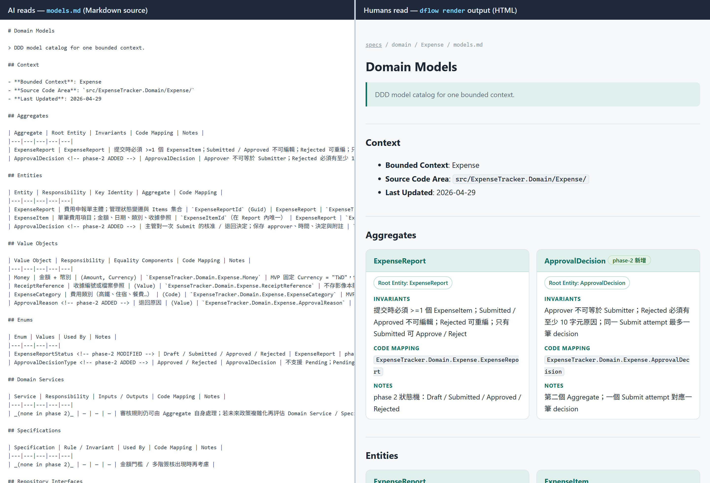

# Dflow

**繁體中文** | [English](README.en.md)

> **AI 協作沒 DDD = 加速混亂；有 DDD = 把 AI 事先約束在領域模型內。**
> Rich Domain Model（業務規則寫在領域物件本身、而非散在 service 或 prompt 裡）把不變條件、業務規則、Aggregate 邊界編碼進物件 — AI 寫的程式碼必須穿過這個契約。Dflow 把 DDD 當成 SDD 的語意骨幹。
>
> **Dflow 不是教 AI 什麼是 DDD——它是一層 scaffold（鷹架）：** 強迫 AI 把每個設計決策的取捨完整留檔，並補上「AI 自己補細節時容易漏、而 review 又難一眼看出」的盲區。
>
> 換句話說，不是「AI 會不會 DDD」，而是「AI 做 DDD 時，你能不能信他」。

具體來說，它是一套 spec-first 的工作流程工具集，專為 AI 輔助軟體開發設計。它為你的 AI 程式設計助理提供具體流程，把變更需求轉成結構化規格、領域語言、實作計畫、漂移檢查、與可審查的程式碼，而不是從 prompt 直接跳到程式碼。

目標不是流程本身，而是讓軟體變更可重複、語意更清楚、規則更不散落、行為更不依賴 prompt。

## 主要特點

| 特點 | 對工程團隊的幫助 |
|---|---|
| **Spec-first 開發** | 把對齊推到實作之前，避免 AI 從模糊 prompt 直接生程式碼後才發現方向錯、回頭重做。 |
| **Greenfield 與 Brownfield 雙軌** | 不只服務新專案；既有 codebase 不必先做大規模重構，可邊改邊把散落各處的領域規則抽出來。 |
| **混合式工作流程控制** | 不是 autopilot 也不是純手動 — 明確命令進入、AI 在你忘記啟動時建議切入、重要決策點停下確認。三層共存讓 AI 不會一路跑偏，也不會把每一步都變成繁瑣流程。 |
| **DDD 語意骨幹** | AI 最容易憑直覺發明業務規則（折扣何時有效、帳號權限邊界），這種錯誤 review 時人眼很難察覺。先把領域語言、邊界、業務規則寫下來，AI 補細節時受專案約束、而不是憑感覺。 |
| **三層文件模型** | 對應 feature branch 的實際節奏：phase（單次提案-實作循環）/ feature（整條 branch 的累積狀態與接續指引）/ system（跨 feature 的長期知識）。許多 spec 工具只有 phase + system 兩層，多次迭代的 feature branch 跨多個 phase 時就會失真。下方有完整說明。 |
| **依改動深淺的 Tier 制（T1/T2/T3）** | AI 依改動深淺自動決定規格與驗證量級：改顏色 / typo 只需 `_index.md` 一行；bug fix 用 lightweight spec + 聚焦驗證；新 feature 或動到 bounded context 才走完整 phase-spec + 分層實作計畫 / 驗證。小修改不會被流程拖累。 |
| **漂移驗證** | `/dflow:verify` 把規格、領域文件、實作、測試、技術債紀錄做交叉比對，找出 PR review 人眼看不出來的「文件還在描述舊行為」漂移。 |
| **Specs 給 AI 讀、也給人讀（md → HTML）** | 多數 spec-first 工具的規格只有 AI 好讀——密集表格加標記的 Markdown，人翻起來吃力，時間一久規格就沒人 review。`dflow render` 把整棵 specs 樹轉成可瀏覽的靜態 HTML：表格變卡片、AI 專用標記變 badge、跨檔連結可點。Markdown 仍是 AI 讀的 source of truth，人另有一份好讀的投影。下方有對照截圖。 |
| **多 AI 工具共用一份規則** | Canonical 專案指南 + 各工具薄 shim（`CLAUDE.md` / `AGENTS.md` / Copilot instructions），團隊在 Claude / Codex / Copilot 之間切換時不必維護多份 workflow 規則。三家還共用一份依 agentskills.io 開放標準的 project-level skill，可用自然語言自動觸發對應 workflow（Copilot CLI 需先打 `/dflow` 喚起）。 |

## 開始使用

前置需求：已安裝 Node.js / npm，且全域 npm bin 目錄已加入 `PATH`。

於要採用 Dflow 的專案根目錄執行：

```bash
npm install -g dflow-sdd-ddd
dflow init
```

init 流程會詢問是 greenfield 或 brownfield、團隊採用的 Git policy（GitFlow / Trunk）、AI commit 的標記方式、以及要設定哪些 AI 工具，接著預覽即將建立的檔案。既有檔案不會被覆寫。Init 只建立 workflow 文件與 AI 指示檔，**不會**檢查、重構、或遷移你的應用程式碼。

有選 AI 工具時，init **預設**同時為選定的工具（Claude / Codex / GitHub Copilot）安裝 project-level skill——自然語言自動觸發的來源（你描述「我要加一個功能」，AI 就主動建議對應 workflow；Copilot CLI 需先打 `/dflow` 喚起）。互動模式會問一題 `(Y/n)`，直接按 Enter 就裝；腳本（非互動）模式不多讀任何答案、直接預設安裝，既有的自動化答案序列照跑不用改。skill 檔是 Dflow 衍生物，建議 gitignore、clone 後重新投影（見下方版控建議表）。

若專案已初始化、之後又要加入另一個 AI 程式設計工具，執行：

```bash
dflow configure-agents
```

它對「新選、而且還沒有 skill」的工具問同一題預設 Y 的 skill 安裝問句（非互動同樣直接預設裝），之後加工具也不會漏掉自動觸發。要強制重生成所有選定工具的 skill（例如升級 Dflow 後刷新內容），用 `--skills`：

```bash
dflow configure-agents --skills
```

答 `n` 略過 skill 不代表 AI 完全不會建議 workflow——init 產生的專案指示（shim + canonical 指南）本身就要求 AI 對 spec-impacting 的請求建議對應的 `/dflow:*` 指令。差別在可靠度：那條路靠模型當下記得指示，對話一長就可能漏；skill 把觸發交給工具原生的匹配機制（skill 的觸發描述每回合都在模型面前），觸發才穩定。略過之後隨時可用 `dflow configure-agents --skills` 補裝。

若還想要工具原生的 `/` 命令 / prompt 選單，再加 `--command-adapters`（可與 `--skills` 並用）：

```bash
dflow configure-agents --command-adapters --skills
```

這些指令會（重新）設定 AI 指示檔、刷新隨專案 vendored 的 workflow bundle，並選配 command adapters / skills；它們不會重跑 init 的互動問答，也不會覆寫你自己撰寫的 specs。

### 開始使用 Dflow workflow

完成 init 之後，透過 AI 程式設計助理走 Dflow workflow：

```text
/dflow:new-feature
/dflow:modify-existing
/dflow:bug-fix
/dflow:new-phase
/dflow:finish-feature
/dflow:verify
/dflow:pr-review
```

`/dflow:*` 是 Dflow 的 canonical 共同詞彙；各 AI 工具的 `/` parser 行為不同。實際輸入方式如下：

| 工具 | 建議叫法 |
|---|---|
| Claude Code（安裝 `--command-adapters` 後） | `/dflow:<id>`，例如 `/dflow:new-feature` |
| GitHub Copilot（VS Code Chat） | 命令入口用 `/dflow-<id>`（連字號，需 `--command-adapters`）；也可自然語言自動觸發。`/dflow:<id>`（冒號）僅當文字稱呼、非命令 |
| GitHub Copilot CLI | 沒有 per-id 命令；先打 `/dflow` 喚起 skill，再用自然語言描述 workflow |
| Codex CLI | 不帶斜線的純文字 `dflow:<id>`，例如 `dflow:new-feature` |

若你的工具不支援自訂 slash command，把 workflow 名稱當成普通對話訊息輸入即可。Dflow 是 Markdown-based 的 workflow 材料加一個 scaffolding CLI，能與任何可讀專案指示與 repo 上下文的 AI 程式設計助理一起運作。

第一次採用建議用 branch 或一次性試用專案，讓團隊先檢視產生的 `dflow/specs/` 工作區，再把流程引入正式程式碼。

完整評估流程（init 產生哪些檔案、AI 工具支援、模式選擇、30 分鐘試用 playbook）見 [評估 Dflow](docs/evaluating-dflow.md)。Greenfield 與 Brownfield 端到端劇情走完與規格範例見 [`tutorial/`](tutorial/README.md) 索引。

### 把 specs 轉成人類可讀的 HTML

Dflow 的 specs 是給 AI 讀的 Markdown（表格緊湊、標記密集）。要給人閱讀時，執行：

```bash
dflow render
```

它把 `dflow/specs/` 鏡像成一棵靜態 HTML 樹（預設輸出 `dflow-specs-html/`，可用 `--src` / `--out` / `--title` 調整）：記錄型表格逐列轉成卡片、AI 專用註解標記變成 badge / chip、gherkin 區塊關鍵字高亮、樹內 `.md` 連結與檔名提及自動改連對應 HTML 頁。開啟輸出目錄的 `index.html` 即可瀏覽（`file://` 直開、免 server）。

同一份 spec 的兩種讀法——左：AI 讀的 Markdown 源（密集表格 + `<!-- phase-2 ADDED -->` 這類 AI 專用標記）；右：`dflow render` 產出的 HTML（逐列變卡片、標記變 badge）：



範例取自本 repo 的 Expense 教學規格（[`tutorial/01-greenfield/outputs`](tutorial/01-greenfield/outputs/)），clone、`npm install` 後可用 `node bin/dflow.js render --src tutorial/01-greenfield/outputs/dflow/specs` 自行重現。

分工模型：**Markdown 是 AI 閱讀的 source of truth；HTML 是人類閱讀投影**。specs 一變就重跑一次 `dflow render` 即刷新（每次執行都是全量重建）。輸出目錄由 render 管理——以 `.dflow-render-manifest.json` 記帳，來源刪除 / 改名後重跑會清掉對應的舊 HTML，非 render 產生的檔案永不會被動到——屬可重生成的衍生物，建議加進 `.gitignore`：

```gitignore
dflow-specs-html/
```

註：render 將 specs 內的行內 HTML（`<br>` 等）原樣輸出、不做 sanitize——它設計上只渲染你自己專案的 specs（trusted source），不要拿它渲染來路不明的 Markdown。

## 專案模式

| 模式 | 何時用 | 主要產出 |
|---|---|---|
| **Greenfield** | 新系統或新 bounded area，有空間早期塑形架構與領域模型 | 乾淨的規格 baseline、領域模型歸屬、feature-by-feature SDD 實作 |
| **Brownfield** | 在既有 codebase 增加或修改行為，業務規則可能已散落各處 | 漸進的領域抽出、更安全的變更規劃、可遷移的領域知識 |

兩種模式區分的是專案起始狀態（新建 vs 既有 codebase），不是 framework 品牌；Dflow 對語言與 stack 不做假設，workflow、tier 制與文件模型可套用任何技術組合。本質是給「希望 AI 協助、又不願放棄領域清晰度」的軟體團隊使用的 workflow 系統。

各 stack（.NET / Java-Spring / Node-TS / Python / Go / PHP-Laravel）的填好範例見 [`docs/examples-by-stack.md`](./docs/examples-by-stack.md)。

### 模式選擇與遷移

模式在 `dflow init` 時選定、之後**不能 in-place 切換**（沒有 `/dflow:switch-to-greenfield` 之類的指令）。Brownfield 設計上是 Greenfield 的前置準備：抽出到專案 domain 層（例如 `src/Domain/`）的領域程式碼，與 `dflow/specs/domain/` 內的領域文件（術語、規則、模型、事件），都是 migration-ready 資產 — 未來要 rewrite 時（建新專案 + 新 `dflow init` 選 Greenfield），可以直接搬過去。`dflow/specs/migration/tech-debt.md` 是 brownfield 專用的遷移債紀錄。

也支援「逐 BC（Bounded Context）遷移」— 某個 BC 的業務邏輯已純化到 domain 層、表現層只剩 UI 綁定後，這個 BC 就已是 Clean Architecture 狀態，不必整個 system 一次性切。Brownfield 的 `/dflow:modify-existing` 內「評估表現層業務邏輯」步驟對該 BC 自然會變 no-op。

## Workflow 模型

Dflow 採用混合設計，user 跟 AI 互動有三個層面：

| 層 | 用途 |
|---|---|
| **命令進入** | 開發者主動以 `/dflow:new-feature`、`/dflow:modify-existing` 等命令開始工作。 |
| **自動偵測安全網** | 當對話明顯指向某個 feature、phase、bug fix、verification、review 時，AI 應主動建議對應的 Dflow flow。 |
| **透明的決策檢查點** | AI 在工作的關鍵節點（flow 進入、Step Gate、重要內部步驟）會停下來告知並等開發者確認方向，避免一路自動跑下去。 |

### Workflow 內部結構

每次 user 下一個 `/dflow:xxx` 指令，就是啟動一個 **Workflow run**。Workflow 內部由編號的 **Step** 組成（例如 `/dflow:new-feature` 共 8 個 Step），Step 之間有兩種邊界：

- **Step Gate** — AI 必須停下宣告即將進入下一個 Step、等 user 確認方向。確認方式：`/dflow:next` 指令、或自然語言「OK / 繼續」、或直接提供下一個 Step 需要的資料（implicit confirmation）
- **Step-internal transition** — AI 只宣告「Step N 完成，進入 Step N+1」、不等待

Step Gate 不是每個 Step 之間都有。以 `/dflow:new-feature` 為例，8 個 Step 中只有 4 個 Step Gate，其他 Step 之間直接推進。

### 依改動深淺調整規格、實作計畫與驗證（Tier 制）

Dflow 依改動深淺自動決定規格、實作計畫與驗證的量級（T1 / T2 / T3 三層）：

| Tier | 典型用途 | 預期份量 |
|---|---|---|
| **T1 Heavy** | 新 feature、新 phase、新 Aggregate / Bounded Context、架構變更、新業務規則 | 完整 phase-spec、領域建模、行為例子、實作計畫、驗證與收尾檢查 |
| **T2 Light** | Bug fix（邏輯錯誤）、UI 驗證調整、有 BR（business rule）delta 的小幅修改 | Lightweight spec、聚焦驗證、確認修復落在正確架構層 |
| **T3 Trivial** | 按鈕顏色、文案 typo、純 formatting — **不動業務規則、不動 Domain 概念、不動資料結構** | `_index.md` 一行紀錄，不另開 spec 檔 |

tier 不是每次都 user 決定 — `/dflow:new-feature` 與 `/dflow:new-phase` 預設一律 T1，`/dflow:modify-existing` 與 `/dflow:bug-fix` 才由 AI 依改動內容判 T1/T2/T3。

**不是每個變更都走 Dflow**：純 typo、純 formatting commit（例如 `prettier` / `dotnet format` 自動跑）連 T3 inline 紀錄都不需要，直接 `git commit` 即可。Dflow 是給有業務語意或結構變動的修改用的。

透明的決策檢查點與 Tier 制有關但獨立：檢查點控制 AI 如何溝通 workflow；Tier 控制變更需要多少規格、實作計畫與驗證。

## 文件模型

實際開發中，一個 feature branch 通常會經歷多次「提案 → 實作 → 完成」循環才整個 finish — 多個 milestone、多次迭代、多筆 commit。Dflow 三層文件模型對應這個節奏：

| 層 | 檔案 | 用途 | 對應的 git 概念 |
|---|---|---|---|
| **Phase Delta** | `phase-spec-{date}-{slug}.md`（或 lightweight spec） | 紀錄此次循環改了什麼、為什麼、怎麼實作與驗證 | feature branch 內的一次 milestone 區間 |
| **Feature Snapshot** | `_index.md`（每個 feature 目錄內） | feature 級 dashboard：phase 列表、cumulative BR Snapshot、Resume Pointer | feature branch 自己的「目前進度」 |
| **System State** | `rules.md` / `behavior.md` / `glossary.md` / `context-map.md` | 跨 feature 的長期知識：術語、業務規則、模型、慣例、技術債 | main / trunk 累積下來的「系統現在實際是什麼」 |

`_index.md` 是關鍵的中間層。很多 spec 工具只有 phase + system 兩層，但 feature branch 跨多次 phase 是常態，少了中間層就會遇到三個痛點：

- 翻所有 phase-spec 才能知道「這個 feature 目前累積到哪」
- 新對話接手時要重建 context，不知道上次做到哪
- 歸檔顆粒度太細或太粗 — 要嘛一份份歸檔失去 feature 全貌，要嘛全部塞進 system 層失去 phase 軌跡

Dflow 用 `_index.md` 解決這三點：Current BR Snapshot 每完成一個 phase 就 regenerate、Resume Pointer 寫接續指引、整個 feature 目錄是自然的歸檔單位。`/dflow:finish-feature` 收尾時，把 `_index.md` 的 BR Snapshot reconcile 到 `rules.md` / `behavior.md`（feature 層晉升到 system 層），然後 `git mv` 整個 feature 目錄到 `completed/`。

## Init 產生的檔案

典型初始化專案會建立 `dflow/` workspace：

```text
dflow/
└── specs/
    ├── shared/
    │   ├── _overview.md
    │   ├── _conventions.md
    │   └── Git-principles-*.md
    ├── domain/
    │   ├── glossary.md
    │   └── context-map.md
    ├── architecture/
    │   └── tech-debt.md
    └── features/
        ├── active/
        └── completed/
```

Dflow 也會為你的 AI 程式設計助理建立或更新專案指示檔；確切檔名取決於目標工具與既有專案設定。Dflow 不覆寫既有專案指示中的自訂內容。

選擇 AI agent 設定時，Dflow 把 `dflow/specs/shared/AI-AGENT-GUIDE.md` 作為 canonical 專案指南，並為每個 AI 工具建立**小型的指向檔**（俗稱 shim，內容很短，只是把該工具引導去讀 canonical 指南）：

| 目標工具 | 產生檔案 |
|---|---|
| Codex / Copilot coding agent | `AGENTS.md` |
| Claude Code | `CLAUDE.md` |
| GitHub Copilot | `.github/copilot-instructions.md` |

若這些檔案已存在，Dflow 不會覆蓋自訂內容；已是 Dflow-generated shim 的檔案
會原地刷新。其他已指向 `dflow/specs/shared/AI-AGENT-GUIDE.md` 的自寫檔不會被
改寫：互動執行會詢問是否在檔尾附加帶 marker 的管理區塊（預設 N），非互動
執行則略過並警告。
若檔案尚未指向 guide，預設會在確認 preview 顯示並於檔案末尾附加帶有
`<!-- dflow-generated: agent-shim START/END -->` markers 的 Dflow block，重跑會
原地更新同一段且不重複。只有檔案內有衝突或 malformed Dflow markers 時，
才會改寫 fallback merge snippet 到 `dflow/specs/shared/`。專案指南保持單一
source of truth，團隊就能用多個 AI 工具而不必維護多份 workflow 規則。

之後團隊採用新 AI 程式設計助理時，可隨時跑 `dflow configure-agents` 新增 shim——它會對新選且尚無 skill 的工具問預設 Y 的安裝問句（非互動直接預設裝），自動觸發不會漏；若需要 Claude / Copilot 的工具原生命令入口，改用 `dflow configure-agents --command-adapters`；要強制重生成所有選定工具的 skill（例如升級 Dflow 後刷新），用 `dflow configure-agents --skills`。

### 產生物的版控政策（建議預設）

`dflow configure-agents --command-adapters` 產生的命令 / prompt wrapper 是從 canonical guide 投影出來的**衍生物（generated artifact）**。Dflow 的**建議預設**是把它們當成可重生成的產物：版控 source、不版控衍生物。

| 檔案 | 角色 | 建議預設 |
|---|---|---|
| `dflow/`（canonical guide、規格、fallback merge snippet） | source | **版控** |
| 薄 shim 或既有 root agent 檔案中的 marked Dflow block（`CLAUDE.md` / `AGENTS.md` / `.github/copilot-instructions.md`） | source | **版控** |
| `.claude/commands/dflow/`、`.github/prompts/dflow-*.prompt.md` | 衍生物 | **建議不版控（gitignore）**，clone 後重跑 `configure-agents --command-adapters` 重生成 |
| `.claude/skills/dflow/`、`.agents/skills/dflow/`、`.github/skills/dflow/` | 衍生物 | **建議不版控（gitignore）**，clone 後重跑 `configure-agents --skills` 重生成 |

這是**建議**，不是唯一正解。若團隊希望 clone 後立即有原生 `/` 選單、或 CI / 開發環境不裝 npm，**版控 adapter** 也是合理選擇——代價是升級若改了命名，要重投影並 commit 刪除舊檔。關鍵原則：**同一專案對所有工具採一致策略**，別像常見的踩雷一樣一邊 ignore、一邊版控。

升級 dflow 後重跑 `dflow configure-agents --command-adapters`，adapter 會用**新版的 command registry** 重投影；`dflow/specs/shared/AI-AGENT-GUIDE.md` 內**帶 marker 的 canonical 區**也會原地刷新（marker 以外——含 `## Project Context`——保留不動），兩者不再錯位。升級時請用**相同的 dflow CLI 版本**重投影。各工具的 `.gitignore` 片段、glob 副作用、`git rm --cached` 切換步驟與升級細節見 per-tool 指南。

**升級既有專案的 caveat**：`configure-agents` 重投影 Dflow 自己擁有的自動層——workflow bundle、command / skill adapters、既有 agent 檔內帶 marker 的區塊、以及 `AI-AGENT-GUIDE.md` 帶 marker 的 canonical 區——並把 `_conventions.md` 的 `> Dflow Version:` 行更新為本次對齊的 CLI 版本（last-reconciled）。它**不會**改寫 user-owned 內容：guide 的 `## Project Context`、`_conventions.md` 其餘內文、init-only starter（`_overview.md`、`Git-principles-*.md`）、以及 shim marker 以外的文字。還沒有 marker 的 guide、或帶有你自己編輯的 agent 檔，Dflow 不靜默改寫——互動執行會**詢問**是否採用 marker（預設 N；guide 採用時 `## Project Context` 保留），非互動則跳過並警告；只有**未經編輯的 pristine Dflow shim** 照舊直接原地重生成。升級後先跑 `dflow doctor`：它以 read-only 回報漂移（對齊版本落後、guide 凍結或 bundle 的 `§` 參照斷裂、政策段非機器格式、舊模板形狀的 feature `_index.md`、未受管的 agent 檔）。要更徹底的驗證，仍以「在別處跑一個**同 edition、同答案的全新 `dflow init`**、再與你的專案逐檔 diff」當基準：每個差異都應能歸類為「你的 user content」或「已知 marker 以外」，否則就是漏修。

特定工具的 init 寫入內容與 Dflow workflow 命令呈現方式，見 `docs/` 內的 per-tool 指南：

- [在 Claude Code 中使用 Dflow](docs/using-with-claude-code.md)
- [在 Codex CLI 中使用 Dflow](docs/using-with-codex.md)
- [在 GitHub Copilot 中使用 Dflow](docs/using-with-github-copilot.md)

Init 不會把 `tutorial/` 目錄複製進你的專案。[`tutorial/`](tutorial/README.md) 目錄存放在本 source repository，作為理解 Dflow 如何在 Greenfield / Brownfield 劇情中運作的評估材料。

## 主要 Flow

Dflow 指令依角色分四類。「我要做的事」對應到指令的速查表附在最後。

### 入口指令（從這裡開始一個 workflow）

啟動一次 workflow run；可在沒有任何既有 feature 的狀態下使用。三者彼此獨立、不互為前置。

| Flow | 何時用 | 典型產出 |
|---|---|---|
| `/dflow:new-feature` | 完全新功能、新增一條系統要實現的業務規則 | feature 目錄 + `_index.md` + 第 1 份 phase-spec（一律 T1） |
| `/dflow:modify-existing` | 改既有行為 — **不確定改動屬於哪類**時用，AI 內部會分流 | T1 → 升 new-phase / new-feature；T2 → lightweight-spec；T3 → `_index.md` inline 一行 |
| `/dflow:bug-fix` | 可清楚陳述預期行為的 defect | AI 判 tier（多為 T2 lightweight-spec）。Orphan bug 會自建最小 feature 目錄 |

### Feature 內指令（限 active feature）

只在已啟動的 active feature 內可用。指向 `completed/` 的 feature 會被拒絕。

| Flow | 何時用 | 典型產出 |
|---|---|---|
| `/dflow:new-phase` | active feature 需要再一個實作切片 | 新一份 `phase-spec-{date}-{slug}.md` + Implementation Tasks + 程式實作 / 驗證 + phase 標記完成（一律 T1） |
| `/dflow:finish-feature` | feature 全部 phase 完成、要收尾 | `git mv` 整個 feature dir 到 `completed/`、sync BR Snapshot 到 BC 層、Integration Summary（不 auto-merge） |

### 流程控制（管理進行中的 workflow run）

| Flow | 何時用 |
|---|---|
| `/dflow:status` | 看現在在哪個 workflow / Step / 進度 |
| `/dflow:next` | 確認過 Step Gate（等同自然語言「OK」/「繼續」） |
| `/dflow:cancel` | 放棄目前 workflow run、回到自由對話。已建立的 artifacts 保留 |

### 獨立工具（任何時候可呼叫，不綁定 feature 或 workflow）

| Flow | 何時用 | 典型產出 |
|---|---|---|
| `/dflow:verify` | 需要確認文件、程式、測試、債務紀錄是否一致 | 跨規格、領域文件、實作、測試、債務的 drift report |
| `/dflow:pr-review` | 變更已準備接受審查 | SDD/DDD 合規 review 清單，含風險、缺口、後續項目 |
| `/dflow:report-dflow-feedback` | 你或 AI 在使用中發現 Dflow 本身的問題 | sanitized 的本地草稿，逐欄對齊上游 issue 表單可直接貼上；不自動送出 |

### 該選哪個指令（rule of thumb）

| 我要做的事 | 直接下指令 |
|---|---|
| 完全新功能（與現有 feature 無關） | `/dflow:new-feature` |
| 為 active feature 加規劃中的下一個 phase | `/dflow:new-phase` |
| 修一個明確的 bug | `/dflow:bug-fix` |
| **不確定**怎麼分類、反正是改既有的 | `/dflow:modify-existing` |
| feature 全部 phase 都完成、要收尾 | `/dflow:finish-feature` |
| 跑變更 review | `/dflow:pr-review` |
| 檢查文件與程式碼 drift | `/dflow:verify` |

### completed feature 是凍結歷史

當 `/dflow:finish-feature` 把 feature 目錄 `git mv` 到 `completed/` 後，**該 feature 不接受任何直接寫入**，無論是新 phase-spec、lightweight-spec、還是 `_index.md` inline 一行。如果之後要再改它，必須建一個 follow-up feature：新 feature 目錄、新 SPEC-ID、`_index.md` 用 `follow-up-of: {原 SPEC-ID}` metadata 連回原 feature。

理由：「completed = 凍結歷史」是 Dflow 的核心保證；若接受 post-completion 修改，feature lifecycle 就失去明確終點、`_index.md` BR Snapshot 也無法可信。`/dflow:modify-existing` 偵測到目標是 completed feature 時會主動詢問 user 三個選項：A 走 follow-up、B 改用 `/dflow:new-feature` 當獨立新需求、C（被拒絕，重新引導至 A）。

## 為什麼 DDD 在 AI 時代更重要

AI 助理擅長把缺少的細節補起來。如果缺少的是「靠規則或慣例就能推出來」的東西（例如命名、樣板語法），這是優點；但如果缺少的是**業務語意**（什麼樣的折扣才算有效、帳號不能做什麼），模型可能會發明一個看起來合理、實際錯誤的規則，而且這種錯誤在 review 時很難一眼察覺。

Dflow 把 DDD 當成規格背後的語意結構：ubiquitous language 讓命名一致、bounded context 防止語意跨領域漏氣、領域規則在實作開始之前先定義什麼是正確、允許、禁止。

在 code-first workflow 裡，設計常常在類別、handler、測試完成後才浮現。在 AI-assisted workflow 裡，規格必須成為產生程式碼的前置條件。實務流程變成：

```text
領域意義 → 結構化規格 → AI 實作 → 程式碼即產出
```

更詳細的說明見 [為什麼 AI 時代 DDD 更重要](docs/why-ddd-for-ai.md)。

## 為什麼用 Dflow（即使 AI 已經會 DDD）

常見的質疑是：「現在的 AI 已經懂 DDD，叫它『用 DDD 建一個 feature』它就會做，再加一層 process 是過度工程。」這句話對了一半——AI 確實能說出對的 DDD 答案。但「能說出對的答案」和「在 review 時看得到它怎麼想、查得出它有沒有漏」是兩回事。所以該比的不是「AI 工具 vs process」，而是 **AI alone vs AI + scaffold**：差別不是更聰明的 AI，是**更可審查的 AI**。

而且 Dflow 的引導是從真實盲區回灌的、補上後模型真的會沿用。一個實例：模型自己建模時，把「同時只能有一筆 active」這類唯一性規則只用 aggregate 內的 in-memory check 保護——教科書上對、但並發下兩個請求會各自通過檢查、破壞不變式（modeling-correct、production-broken）；把這個盲區寫成一段引導補進 Dflow 後，換一個 domain 重跑，同一個模型就主動引用它、補上 DB 層保護（unique index + concurrency token + 409）。Dflow 的價值就在這：把「AI 自己會漏的盲區」固化成可重用、會被遵循的引導。

對需要 audit 的領域（醫療、金融、合規、任何「上線出包代價高」的場景），這個差異是 deal-breaker。成本要分兩塊看：**產出** DDD 文件已經不是徒手做 DDD 的年代——AI 幫你生規格、決策紀錄與領域模型，邊際成本主要是多花一些 token 與走一遍流程；而且光是「生成時被領域模型約束」就已讓產出更穩（如前面那個並發盲區），這部分就算你沒深讀紀錄也拿得到。但要再兌現「可審查」這份價值，得有人實際去 review 那份紀錄——那才是人力與紀律的成本。所以取捨仍在：高風險、需 audit、要長期維護時，這筆投資明顯划算；你不會去 review、失敗成本低、迭代又快時，AI alone 仍可能更實際。

完整的迴路（盲區怎麼變成引導、為什麼這歸到引導內容而非 domain / framing 的差異）、其他幾個「Dflow 強制留檔、AI 自己容易漏」的觀察，以及自己動手驗證的步驟，見 [為什麼用 Dflow](docs/why-dflow.md)。

## Repo 結構

| 路徑 | 用途 |
|---|---|
| `bin/` | CLI 進入點 |
| `lib/` | CLI runtime 實作（init / configure-agents / doctor / render） |
| `templates/` | workflow 內容唯一來源；`dflow init` / `dflow configure-agents` 由此投影到你的專案 |
| `test/` | 產出物的 smoke test |
| `tutorial/` | 引導式學習劇情與預期產出 |

## 貢獻與發布

issue 與 pull request 指引見 [CONTRIBUTING.md](CONTRIBUTING.md)。Pull request 會在 review 前跑 GitHub 上自動 verification workflow。Maintainer-facing 的 release 規則見 [Release and Versioning Policy](docs/release-versioning-policy.md)；手動 npm flow 見 [npm Publish Checklist](docs/npm-publish-checklist.md)。

## 狀態

Dflow 目前以 `dflow-sdd-ddd` 名稱發佈於 npm。最新發佈版本為 `0.14.0`，涵蓋：

- 專案初始化（`dflow init`）與 idempotent 升級重投影（`dflow configure-agents`）
- Workflow 文件（`/dflow:*` 流程）＋隨專案 vendored 的 workflow bundle
- 多 AI agent 設定：canonical 指南 + 各工具薄 shim（CLAUDE.md / AGENTS.md / Copilot instructions）；既有 agent 檔以帶 marker 的區塊自動注入、零手動合併
- 升級時 guide 的 Dflow canonical 段落 marker-guard 原地刷新；舊 guide / 舊 agent 檔的 consent-gated marker adoption（0.14）
- 三家原生 project-level skill（Claude / Codex / GitHub Copilot），**init 預設安裝**（0.13）、共用 agentskills.io 開放標準、支援自然語言自動觸發（Copilot CLI 仍需先打 `/dflow` 喚起）
- 選配工具原生命令入口（`--command-adapters`）；`--skills` 補裝 / 強制重生成 skill
- `dflow render`：specs Markdown → 可瀏覽的靜態 HTML 鏡像（給人讀；`file://` 直開、免 server；0.13）
- AI agent 可讀的 SDD/DDD 指引，含深化的 DDD 戰術建模指引與模型生命週期閉環（長時流程與模型重審；0.11–0.12）
- `dflow doctor` 唯讀專案健康檢查，含升級 drift 偵測（版本行、政策格式、guide 凍結與 dangling 參照、starter 漂移、模板形狀；0.14）
- 公開 onboarding：evaluator 指南，Claude Code / Codex CLI / GitHub Copilot 的 per-tool walkthrough
- 僅驗證的 CI workflow（不執行 publish）

GitHub 上的 source 可能包含 `0.14.0` 之後尚未發佈的 repo 變更。完整 release history 見 [CHANGELOG.md](CHANGELOG.md)。

## 授權

GNU Affero General Public License v3.0 或更新版本（AGPL-3.0-or-later），見 [LICENSE](LICENSE)。
