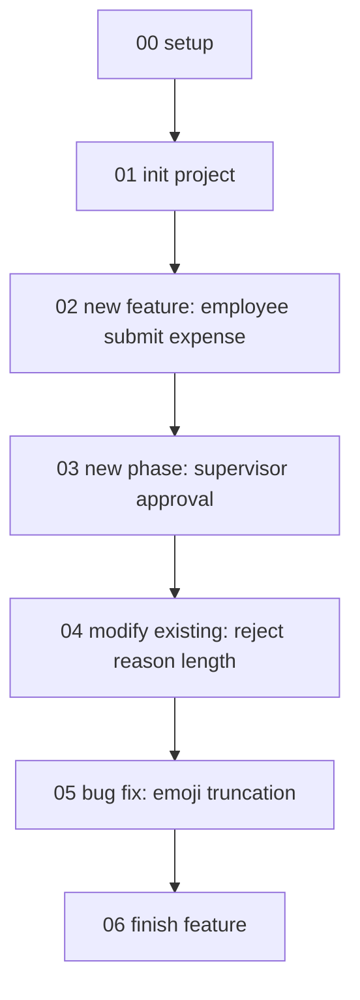

# Tutorial 劇情 1（Greenfield Core）— ExpenseTracker 與 Alice

## 適用對象

這份劇情給準備從零建立 ASP.NET Core 系統、想用 Dflow 把 SDD / DDD 流程落到日常開發的工程師、Tech Lead 與 PO 參考。原型是一支 3-5 人的小型全端團隊：有 Clean Architecture 方向，也理解 DDD 概念，但還需要流程守衛把需求、規格、Aggregate 設計、測試與文件收斂串起來。

劇情 1 的重點是 greenfield：Alice 不需要先面對 legacy code，也不需要從 Code-Behind 抽離業務邏輯。她要做的是在新專案剛開始時，把 Dflow baseline 建好，然後用第一個 feature 建立第一個 Bounded Context、Aggregate、Value Object 與 Domain Event。

## 與劇情 2 的差異

| 面向 | 劇情 1：Alice / ExpenseTracker | 劇情 2：Bob / OrderManager |
|---|---|---|
| 專案狀態 | 新建 ASP.NET Core 專案，尚未有 production legacy code。 | 已上線多年的 ASP.NET WebForms brownfield 系統。 |
| 主要 entry point | `npx dflow-sdd-ddd init` 後接 `/dflow:new-feature`。 | `npx dflow-sdd-ddd init` 後接 `/dflow:modify-existing`。 |
| Domain 處理方式 | 直接建立 Clean Architecture / DDD tactical model。 | 從既有 Code-Behind / Stored Procedure 行為逐步抽出可測試 Domain logic。 |
| 主要風險 | 過早切錯 Aggregate / BC，或 spec 寫得太抽象。 | 未捕捉 current behavior 就重構，造成 regression。 |
| Tutorial 觀察重點 | First feature 如何建立 Expense BC 與 phase lifecycle。 | Brownfield baseline capture 與 incremental modernization。 |

## 角色 — Alice

Alice 是新成立「差旅費用平台」小組的 PO + 全端工程師。她熟悉 ASP.NET Core、EF Core 與一般 Clean Architecture 分層，但團隊裡不是每個人都有 DDD 實戰經驗。她導入 Dflow 的目的，是讓團隊在第一個 feature 開始就把需求、規則、模型與測試放在同一條軌道上，而不是等 code 寫完才補文件。

Alice 的工作方式偏務實。她不想在專案第一天就畫完所有 Bounded Context；她只想從最核心的「員工提交費用單」開始，讓 Expense 這個 BC 自然長出來。後續的主管審核、財務匯款、多幣別、報表等需求，都會透過 feature phase 或新 feature 逐步展開。

## 假想專案 — ExpenseTracker

### 業務領域

ExpenseTracker 是公司內部差旅費用申報與核銷平台。員工出差或有公務支出後，可以建立費用申報單、附上費用項與收據，送給主管審核；主管核准後，財務再進行核銷與付款。

這個系統的核心價值不是 CRUD，而是跨角色的業務流程：員工提交資料、主管判斷合理性、財務確認付款條件，每一步都有不同的規則與狀態轉換。

### 技術棧

| Item | Choice |
|---|---|
| Runtime | .NET 9 / C# 13 |
| Web | ASP.NET Core 9 Web API |
| ORM | EF Core 8 |
| Mediator | MediatR 12 |
| Test | xUnit |
| Database | PostgreSQL 16 |
| Auth | Company SSO via OIDC |
| Hosting | Azure App Service |

### 既有目錄結構（before Dflow）

Alice 已經先用 `dotnet new` 或團隊範本建立 Clean Architecture solution：

```text
ExpenseTracker/
├── .git/
├── ExpenseTracker.sln
├── src/
│   ├── ExpenseTracker.Domain/
│   ├── ExpenseTracker.Application/
│   ├── ExpenseTracker.Infrastructure/
│   └── ExpenseTracker.WebAPI/
└── tests/
    ├── ExpenseTracker.Domain.Tests/
    ├── ExpenseTracker.Application.Tests/
    └── ExpenseTracker.Integration.Tests/
```

此時還沒有 `dflow/specs/`。Alice 下一步會在 repo root 執行 `npx dflow-sdd-ddd init`，建立 Dflow baseline。

## 劇情流程



## baseline outputs 在哪裡

Greenfield outputs 位於 [`tutorial/01-greenfield-core/outputs/`](outputs/)。這些檔案模擬 Alice 跑完 init、new-feature、new-phase、modify-existing、bug-fix 與 finish-feature 後的 Dflow docs。

核心 outputs 包含：

| Path | 用途 |
|---|---|
| `outputs/dflow/specs/shared/_overview.md` | ExpenseTracker 的 project overview、stakeholders、tech stack 與 architecture sketch。 |
| `outputs/dflow/specs/shared/_conventions.md` | spec 撰寫慣例與 `Prose Language`。 |
| `outputs/dflow/specs/domain/Expense/` | 第一個 Bounded Context 的 context、models、rules、events。 |
| `outputs/dflow/specs/features/completed/SPEC-20260428-001-employee-submit-expense/` | 第一個 feature 的 phase specs、aggregate design、bug fix 與 final `_index.md`。 |
| `outputs/CLAUDE.md` | repo root AI collaboration guide。 |

## 下一個劇情段

→ [`01-init-project.md`](01-init-project.md)：Alice 在 shell 執行 `npx dflow-sdd-ddd init`，建立 ExpenseTracker 的 Dflow baseline。
